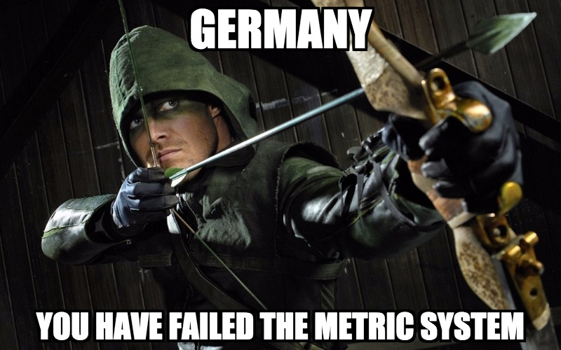

<link
	rel="stylesheet"
	href="https://cdnjs.cloudflare.com/ajax/libs/KaTeX/0.5.1/katex.min.css">

# {{page.title}}

Some of you might watch the TV series "Arrow".
Every time the Arrow catches a criminal who is supposedly harming
his city, he will point it out to them in a theatrical fashion and yell:

> &lt;name of the criminal&gt; - You have failed this city!

I wish we would have someone like him for all the people and organizations
which fail the metric system or standardization in general.
A standardization vigilante who is crusading against those
who refuse to join the golden path of standardization.
Maybe something like "Captain ISO"? 😂

Joking aside, it's striking how often standards
are ignored or non-standard units are used, even in countries
which claim to be metric.

Lately I've become a huge fan of the blog
[themetricmaven.com](http://themetricmaven.com),
in which an US Engineer explores issues arising
from sticking to the "imperial mess of units".
It also made me think of how Germans use units and how the quest for
metrication and standardization has fared here.
I already knew that the US is a huge mess,
but it just dawned on me lately that Germany is only better of
by <del>an inch</del> <ins>a millimeter</ins>.

So let's get started and have a look at all those nasty problem areas.

## Time

While we're far better of with our 24 hours notation then the US
with its PM and AM, in colloquial German we don't always stick to it.
For example, if you want to meet up with someone
you could ask or text them: "Sollen wir uns um 9 Uhr treffen?"
(Shall we meet at 9 o'clock?)

This, however, does not necessarily mean 09:00 (9 AM).
It can just as well mean 21:00 (9 PM).

One might argue that the same problem holds true for US english
to a certain degree as well.
The advantage of the US system, however, is that "nine P-M" is even shorter
to say than "nine o-clock".
This leaves little reason to prefer the ambiguous "nine o-clock"
over the shorter and more precise "nine P-M".

In German, however, it's kind of awkward to say
"um ein-und-zwan-zig Uhr" (at twentyone o'clock)
and so people often just say "um neun" (at nine).

<small>You also can't just say "um ein-und-zwan-zig"
without the "Uhr" at the end.
Nobody would be sure what you are talking about.
For digits from 1 to 12, however, it's perfectly fine to skip the "Uhr"
and everybody still knows that you are talking about a time.</small>

As you have to infer the correct time from the context -
which is not always possible - this is less than optimal.
It already has (at least in my life) lead to confusion
and misunderstanding a few times.

## Date

The common way to write a date in Germany is DD.MM.YYYY.
The 23. September 2015 e.g. would be 23.09.2015.
This is already better than the absolutely ridiculous US way
of using MM/DD/YYYY, but it still sucks.

The beauty of the standardized YYYY&#8209;MM&#8209;DD (ISO 8601) is
that it's sorted from large to small.
That means if you e.g. name you files accordingly, they will automatically
be sorted by date, as the lexicographical order (alphabetical order)
is then the same as the chronological order.
Another good example is skimming of dates in a list.
If you are just interested in the year of a date, you don't have to
read the useless day and month values first.
This is even more obvious when you use the full datetime format.
E.g. 2015&#8209;09&#8209;23 17:46:23.
It's neatly ordered, ascending by magnitude of denoted time,
and can be filtered step by step by year, month, day, hour, minute and second.

The funny (or rather sad) thing is that in 1996 the corresponding
DIN standard (the German version of the ISO standard)
declared YYYY-MM-DD the only valid date format in Germany.
This means that all national institutions - educational as well as public -
were supposed to use exclusively this format.
**I can't remember having learned it at school at all.** 😡
However, as the Germans did not really bother to use the format, they
reintroduced the old way as a valid date format in 2001.

This decision is just absolutely unbelievable to me.
What's next? How about we discontinue some laws or road signs,
because you know: People don't really stick to it.

## Power

One of the most beloved items of the Germans is of course "Das Auto"
(the car) 🚙.
Included therein are lengthy discussions of
who has the better and faster one.
And while the times of riding a horse as a means of transportation
are long gone, people still mostly use horses to express the
power of their car.
They proudly state how much "Pferdestärken" (horsepower)
it has, instead of using the much more suited SI unit kilowatt.

<small>By the way: The US/UK version
of the horsepower - also called imperial mechanical horsepower -
isn't even the same as the German metric horsepower.
To be exact:
1 metric hp is 0.986 imperial mechanical horsepower.</small> 🙈

But to be fair, it seems like we're on the right track with this issue.
Since 2010 it's mandatory to specify the power of vehicles in ads
also in kW.
Furthermore, manufacturer even seem to prefer kW over PS in ads for
electric vehicles.

## Speed

Talking about cars:
Of course Germans love to go fast on the "Autobahn"
and they properly measure their speed in km/h.
The more of them they measure, the better.

However, there is one little problem:
We tend to be a little sloppy with our language.
Germans often say "k m h" instead of
"Kilometer pro Stunde" (kilometer per hour),
which is actually something entirely different,
namely km&nbsp;&middot;&nbsp;h instead of km/h.
You might say that this is half as bad as long as you just say it,
but mean the correct thing.
This, however, is exactly the problem.
I bet many math and physics teachers can tell you a thing or two about
students not just saying, but also using it the wrong way
and being surprised afterwards that nothing makes any sense.

This is the situation on land.
If we go onto the water, however, we throw our metric system simply over board.
Suddenly we start to measure wind speeds with "Knoten" (knots) or Beaufort,
distances with "Seemeilen" (nautical miles)
and start to use a handful of other antique units.

**How's that again?
We adopted the metric system?
Don't make me laugh!**

## Energy

We all need it, we all consume it, we all name it wrong.
Not that is not already bad enough that we still use "Kalorie" (calorie)
although joule is required by law since 1969.
No, we even use it the wrong way. Like the US we say "Kalorie",
although we mean "Kilokalorie".
And I feel that it has even gotten worse in recent times.
Previously, at least some people said it correctly
and most products were advertised with "Kilokalorie".
But nowadays nobody seems to care anymore and e.g. recently I noticed that
exclusively "Kalorie" was used in the descriptions
and the software of my gym's fitness machines.
And all this trouble even though the conversion isn't difficult.
The $kJ$ (kilojoule) value is approximately $4$ times the $kcal$ (kilocalorie) value.
i.e $50\,kcal \approx 200\,kJ$

Even better, it is very imaginative.
$1\,kJ$ is approximately the energy needed to lift $100\,kg$ vertically $1\,m$.
This means if you eat one piece of German chocolate ($\approx 90\,kJ$) you
can lift a quarterback $90$ times $1$ meter. 💪
Now you also now why eating less is far more important for loosing weight
than exercising.

## Length

Worst of all, even the parade discipline of the metric system -
measuring lengths - is not spared.
For many fields there exists the convention to use "Zoll" (inch)
as the preferred (or even the mandatory) unit.

Just to name a few items of the endless list of things
you have to buy in inch sizes:

- Displays
- Wheels
- Surfboards
- Many tools
- …

We also use specialized units, which are derived
from the imperial units. E.g.:

- Font sizes are measured in point instead of millimeter
- Resolution in $dpi$ or $ppi$ (dots/pixel per inch) instead of $d/mm$ or $px/mm$ (dots/pixel per mm)

Lastly, we still use imperial units in our language.
You can say:

- "Meilenweit von etwas entfernt sein" (to be miles away from something)
- "Meilenstein" (milestone)
- "Etwas 3 Meilen gegen den Wind riechen" (smell something a mile off)
- "Zollstock" (yardstick)

## Mass

Luckily, we have at least succeeded
in switching to the metric units for measuring mass … except for one little stubborn unit:
"Karat" (carat)

This is a particularly nasty one, because it actually means two things
and I don't think many people are aware of it.
In conjunction with gold, carat is a unit to specify the purity of the gold.
In conjunction with diamonds and other gemstones, it is a unit of mass.

Yes, seriously!
It is the culmination of human idiocy.

Let's make an example:
You want to buy your fiancé(e) a beautiful diamond ring.
The salesman in the jewelry store might show you a particularly lovely one
and explain that it's made from $18$ carat yellow gold and is topped with a
$2$ carat diamond.
What this actually means is that the ring is made from a gold alloy,
which contains $\frac{18}{24} = 0.75 = 75\%$ pure yellow gold
and that the diamond has a mass of $2 \cdot 0.2\,g = 0.4\,g$.

… but I can understand that making transparent statements about the composition
of jewelry is not in the interest of the salesman.
E.g. calling it $12$ carat gold sounds much better than admitting that
actually only $50\%$ of it is real gold.

---

**Summing up:**
This rant got a little out of hand.
I didn't expect it to get so comprehensive.
Which, however, is a just another evidence of how broken our
*oh so beautiful* system of units is.
But hey, at least it's made in Germany.

The only good thing is that it doesn't have to stay this way.
It's in our hands to change our daily (bad) habits,
to encourage friends to do better
and to urge companies and organizations to use
the internationally recommended units.
**Let's make our world a little less complicated and confusing!**

